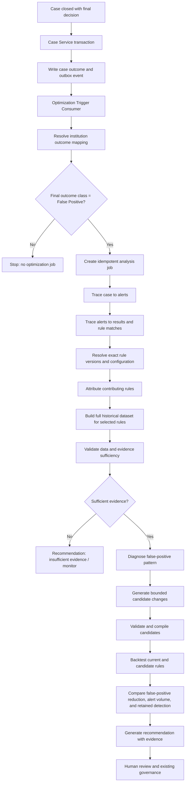
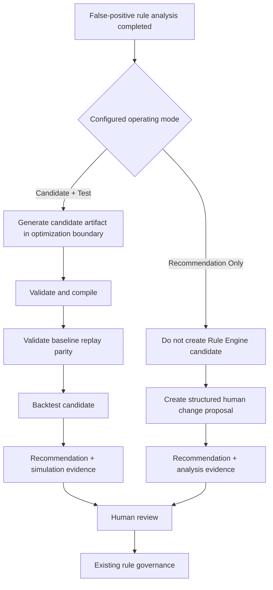
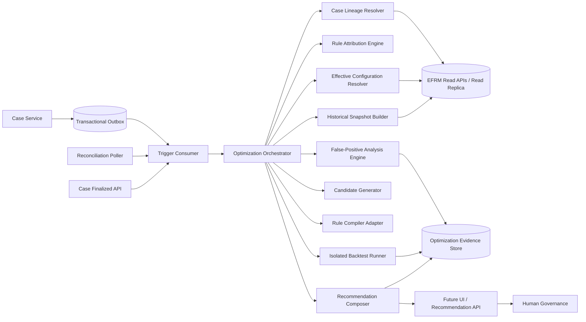

# False-Positive-Triggered Rule Optimization Agent

## Technical Workflow and Architecture for Approval

**Design decision:** The Agent does not scan and optimize every rule. It starts only when a final case outcome is classified as false positive. The false-positive case identifies candidate rules; the Agent then evaluates those rules against their full relevant historical population before recommending any change.

**Configurable operating modes:**

- `CANDIDATE_AND_TEST`: create an in-memory/optimization-store candidate, validate it, simulate it, and recommend it when supported by evidence.
- `RECOMMENDATION_ONLY`: analyze the existing rule and produce a human-readable change recommendation without creating or writing a candidate in the Rule Engine or its configuration.

## 1. Scope

The Agent:

- listens for newly finalized false-positive cases;
- traces each case to its alerts, detection results, rule matches, and rule versions;
- determines which rules materially contributed to the case;
- analyzes only those selected rules;
- diagnoses why false positives may be occurring;
- generates bounded candidate changes;
- backtests current and candidate logic;
- produces a concise rule-change recommendation with evidence;
- sends the recommendation for human review.

The Agent does not:

- analyze every rule on a recurring full scan;
- treat one false-positive case as proof that a rule is defective;
- assume every rule attached to a multi-alert case is responsible;
- modify, activate, retire, or delete a rule;
- write directly to production rule tables;
- replace final human governance.

## 2. Critical distinction

```text
Selection scope:
  Use false-positive cases to decide which rules need analysis.

Evaluation scope:
  Use the complete eligible historical population for each selected rule
  to measure and backtest it correctly.
```

Analyzing only the false-positive rows would create a biased result. The Agent needs non-alerted events, other alerts, and internally confirmed outcomes to understand whether a proposed change reduces false positives without removing useful detection.

## 3. Preferred trigger design

### Primary: event-driven trigger

When the Case Service finalizes a case:

1. it commits the final case decision;
2. it writes a `CASE_FINALIZED` event to a transactional outbox in the same database transaction;
3. an outbox publisher sends the event;
4. the Optimization Trigger Consumer receives it;
5. the consumer resolves the institution-specific decision mapping;
6. it starts optimization only when the effective outcome class is `FALSE_POSITIVE`.

The event should contain identifiers, not full case/customer data:

```json
{
  "event_id": "uuid",
  "event_type": "CASE_FINALIZED",
  "case_id": 12345,
  "institution_id": "institution",
  "decision_code": "institution-specific-code",
  "decision_version": "mapping-version",
  "decision_finalized_at": "ISO-8601",
  "correlation_id": "uuid"
}
```

The consumer is idempotent on `event_id` and `(case_id, decision_finalized_at)`.

### Secondary: explicit API trigger

If the Case Service cannot publish events initially, it may call:

```text
POST /v1/rule-optimization/triggers/case-finalized
```

The request contains the same identifiers and an idempotency key.

### Fallback and reconciliation: polling

A scheduled worker may query finalized cases using a durable high-water mark:

```text
(decision_finalized_at, case_id)
```

Polling must use an approved read API or parameterized query. It must not repeatedly scan the entire case table.

Recommended production pattern:

- event-driven trigger for low latency;
- scheduled reconciliation poll to recover missed events;
- explicit API only as a transitional integration or controlled manual replay.

### Event trigger versus API call

Both methods eventually create the same internal optimization job.

- With an **API call**, the Case Service directly waits for an HTTP response from the Optimization API. The services are more tightly connected, and the caller must retry failures.
- With an **event**, the Case Service records that the case was finalized and continues. A consumer handles the event asynchronously, can retry independently, and does not make case closure depend on the Optimization Service being online.

The transactional outbox is a small database table used to save the business update and its integration event in the same database transaction. This prevents the case from closing successfully while the corresponding event is lost.

## 4. End-to-end orchestration



### Mode branch



## 5. Detailed working steps

### Step 1: Receive and validate the trigger

Input:

- case ID;
- institution ID;
- final decision code and time;
- event/correlation/idempotency IDs.

Processing:

- authenticate the source;
- confirm that the case is finalized;
- load the effective institution outcome mapping;
- confirm final outcome class `FALSE_POSITIVE`;
- reject duplicate triggers;
- create an optimization job.

No LLM is used.

### Step 2: Build the case lineage

The Case Lineage Resolver reads:

```text
case_master
  -> case_alert_mapping
  -> transaction_alert or device_alert
  -> transaction_result or device_result
  -> transaction_match or device_match
  -> rule code/version/group version
```

The final case decision is authoritative. Alert-level decisions remain evidence but do not override it.

Output:

- all linked alerts;
- alert source identity;
- all matched rules;
- rule versions and execution groups;
- timestamps and scores;
- data-quality flags.

### Step 3: Attribute contributing rules

A false-positive case may contain several alerts and several rule matches. The Agent must not blame all rules automatically.

For every rule, the Attribution Engine records:

- whether the rule fired on the alert-producing result;
- its signal weight and severity;
- whether it affected the final decision;
- whether the alert would exist without that signal, when determinable;
- whether other rules independently caused the alert;
- whether the case contains unrelated alert sources.

Rules are classified:

```text
PRIMARY_CONTRIBUTOR
SUPPORTING_CONTRIBUTOR
COINCIDENTAL_MATCH
UNRESOLVED_ATTRIBUTION
```

Only primary/supporting rules move to optimization. Unresolved attribution may produce a review recommendation but not an automatic candidate.

### Step 4: Deduplicate and aggregate triggers

Multiple false-positive cases may point to the same rule.

The Orchestrator:

- links the new case to an open rule-analysis job when scope and time window match;
- enforces a configurable quiet period/debounce window;
- avoids running the same backtest once per case;
- keeps every triggering case as evidence.

Trigger thresholds are configurable, for example:

- analyze immediately for a critical false-positive pattern;
- otherwise wait for a minimum count/rate;
- schedule a periodic batch for accumulated cases.

Until thresholds are approved, the system may create a review job for each new trigger but must not infer that one case proves a rule problem.

### Step 5: Resolve exact configuration

The Effective Configuration Resolver loads:

- `rule_master`;
- exact `rule_version.logic` and `drl_rule`;
- group version and binding;
- decision policy/upgrades;
- required data;
- Metric Definition Custom SQL;
- source/engine field mappings;
- institution/channel optimization policy.

It creates an immutable configuration bundle and checksum.

### Step 6: Build the full evaluation dataset

For each selected rule, the Historical Snapshot Builder retrieves all eligible events in the configured lookback period:

- events where the rule fired;
- events where it did not fire;
- alerts/cases with final outcomes;
- other rule matches for overlap analysis;
- event-time rule inputs and Custom-SQL metrics.

The Builder uses approved queries against a read replica/analytical store. An LLM never writes SQL.

### Step 7: Validate sufficiency and lineage

Checks include:

- complete request/master/result linkage;
- correct alert and case mapping;
- exact or preserved historical rule identity;
- separated test data;
- reproducible Custom-SQL metrics;
- sufficient events and false-positive evidence;
- sufficient other outcomes to evaluate detection loss;
- replayable configuration.

If checks fail, output:

```text
INSUFFICIENT_EVIDENCE
LINEAGE_FAILED
CONFIGURATION_AMBIGUITY
REPLAY_NOT_POSSIBLE
```

### Step 8: Diagnose the false-positive pattern

Deterministic Python/statistical analysis checks:

- common threshold proximity;
- shared transaction/device characteristics;
- source/channel concentration;
- repeated entities;
- missing/default input values;
- rule overlap;
- candidate exclusion patterns;
- alert-volume trend;
- configuration or data changes.

An optional pattern-discovery model may cluster similar cases later, but it is not required for the first implementation.

### Step 9: Generate candidates

Candidates are created from the existing structured JSON rule representation.

Supported examples:

- threshold increase/decrease;
- approved condition addition;
- source/channel-specific condition;
- time-window change;
- duplicate/cool-down condition;
- split scenario;
- no-change recommendation;
- retirement-review recommendation.

When optimization constraints are not defined, candidates remain `CANDIDATE_FOR_REVIEW`.

This step runs only in `CANDIDATE_AND_TEST` mode. The candidate is stored in the Optimization Evidence Store or kept as a job artifact. It is not inserted into `rule_version` and is not written to the production Rule Engine.

In `RECOMMENDATION_ONLY` mode, the Agent skips candidate creation and compiler integration. It derives a structured recommendation proposal such as “increase threshold,” “add condition,” or “review for retirement,” with evidence and human-readable reasoning.

### Step 10: Validate and compile (`CANDIDATE_AND_TEST` only)

The Candidate Validator:

1. validates the formal JSON schema;
2. checks types/operators/attributes;
3. resolves Metric Definition dependencies;
4. calls the existing JSON-to-DRL compiler through `RuleCompilerPort`;
5. compiles DRL;
6. creates a checksum;
7. runs unit and safety tests.

### Step 11: Validate historical replay and backtest

In `CANDIDATE_AND_TEST` mode, first replay the current rule and prove baseline replay parity with stored results.

Then replay each candidate against the exact same full historical population.

Baseline replay parity does not mean replaying a message queue or copying match rows. It means:

1. take the exact historical rule version and inputs;
2. run them again in the isolated Rule Engine;
3. compare the new simulated matches/decisions with the matches/decisions previously stored;
4. continue only when they agree within an approved tolerance.

This proves that the simulator behaves like the Rule Engine that produced the historical data. Without this check, a candidate may appear better only because the test environment uses different mappings, metrics, compiler behavior, or Drools behavior.

In `RECOMMENDATION_ONLY` mode, compiler replay is optional and normally skipped. The Agent performs evidence analysis and can use deterministic sensitivity calculations when possible, but it must clearly state that no executable candidate backtest was performed.

Compare:

- false-positive cases prevented;
- alerts prevented;
- alert-volume change;
- internally useful detections retained/lost;
- unique rule coverage;
- delayed/missed detections;
- results by institution/source/channel;
- execution failures and latency;
- uncertainty and data limitations.

### Step 12: Produce the recommendation

The user-facing output is one recommendation object, not a long general report.

Example structure:

```json
{
  "recommendation_id": "uuid",
  "institution_id": "...",
  "rule": {
    "rule_code": "...",
    "version": 1
  },
  "status": "CHANGE_RECOMMENDED",
  "issue": "The rule created repeated false-positive cases near the current threshold.",
  "recommended_change": {
    "type": "THRESHOLD_CHANGE",
    "current": "...",
    "proposed": "..."
  },
  "why": [
    "Explanation based on evidence"
  ],
  "evidence": {
    "triggering_false_positive_cases": 0,
    "historical_population": 0,
    "current_alerts": 0,
    "candidate_alerts": 0,
    "false_positives_prevented": 0,
    "useful_detections_lost": 0,
    "backtest_id": "..."
  },
  "limitations": [],
  "action": "HUMAN_REVIEW_REQUIRED"
}
```

Allowed recommendation statuses:

```text
CHANGE_RECOMMENDED
NO_CHANGE_RECOMMENDED
RULE_REVIEW_RECOMMENDED
RETIREMENT_REVIEW_RECOMMENDED
INSUFFICIENT_EVIDENCE
```

The system still stores full evidence internally for audit and reproducibility.

The recommendation records `operating_mode` and separates:

- `ANALYSIS_EVIDENCE`;
- `PROPOSED_HUMAN_CHANGE`;
- `EXECUTABLE_CANDIDATE_ARTIFACT` (only in Candidate + Test);
- `SIMULATION_EVIDENCE` (only when a backtest ran).

### Step 13: Human governance

Humans decide whether to:

- reject the recommendation;
- request more evidence;
- accept a draft candidate;
- change a threshold;
- update a scenario;
- review the rule for retirement.

All changes occur through the existing rule governance process.

## 6. Technical components



## 7. Agentic behavior

The Agent is a bounded autonomous workflow, not an unrestricted chatbot.

The Orchestrator chooses the next permitted action based on stage results:

```text
false-positive trigger
  -> collect evidence
  -> resolve tools/configuration
  -> check sufficiency
  -> diagnose
  -> propose bounded candidates
  -> validate
  -> backtest
  -> recommend or stop
```

Tool contracts:

| Tool | Responsibility |
|---|---|
| `get_final_case` | Read final case decision and scope |
| `get_case_alerts` | Read alert mappings |
| `resolve_alert_lineage` | Map alerts to results and matches |
| `resolve_rule_configuration` | Return exact effective rule bundle |
| `build_rule_snapshot` | Build full historical evaluation data |
| `calculate_false_positive_patterns` | Produce deterministic analysis |
| `generate_candidates` | Create policy-bounded structured candidates |
| `compile_candidate` | Use existing compiler |
| `run_backtest` | Replay current/candidate rules |
| `compose_recommendation` | Create evidence-linked output |

The LLM, if enabled, may:

- explain the diagnosed pattern;
- turn a structured candidate diff into plain language;
- write the `why` section;
- summarize limitations.

The LLM may not:

- decide that a case is false positive;
- query the database directly;
- generate unrestricted SQL;
- calculate authoritative metrics;
- bypass candidate validation;
- activate or modify a rule.

## 8. Implementation sequence

### Phase A: Trigger and lineage MVP

- case-finalized event/API;
- idempotent trigger consumer;
- institution outcome mapping;
- case → alert → result → match → rule trace;
- recommendation status `INSUFFICIENT_EVIDENCE` or `RULE_REVIEW_RECOMMENDED`.

### Phase B: Historical evidence and analysis

- full eligible-event snapshot;
- false-positive pattern metrics;
- overlap/attribution analysis;
- alert-volume calculations;
- aggregation/debounce of repeated case triggers.

### Phase C: Candidate and replay

- structured candidate generation;
- existing compiler adapter;
- current-rule replay parity;
- candidate backtesting;
- current-versus-candidate evidence.

### Phase D: Recommendation and governance integration

- recommendation JSON/API;
- optional LLM explanation;
- future UI integration;
- approval/audit linkage;
- draft handoff to existing governance.

## 9. Approval decisions

Recommended for approval:

1. Use final false-positive case closure as the analysis trigger.
2. Use event-driven outbox integration as the target design.
3. Keep reconciliation polling as a recovery mechanism.
4. Use the false-positive case only to select rules.
5. Evaluate selected rules on their full historical eligible population.
6. Attribute responsibility before optimizing rules from multi-rule cases.
7. Produce a recommendation object as the primary user output.
8. Keep complete evidence internally.
9. Require human governance for every production action.
