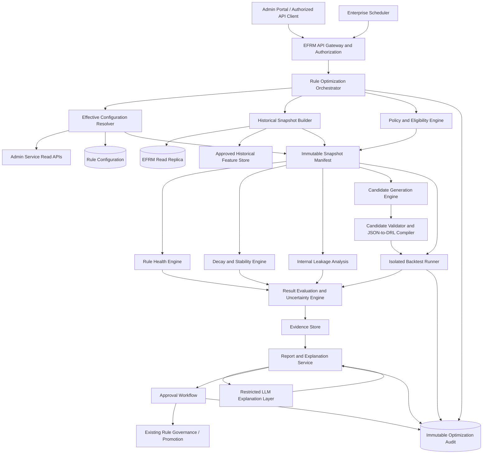

# EFRM Rule Optimization Agent

## Enterprise Architecture and Implementation Blueprint

**Status:** Architecture baseline refined from the EFRM PRD, DB flow reference, and PostgreSQL dump  
**Scope:** Transaction and device rules executed by the existing Rule Engine  
**Operating model:** Recommendation-only, human governed, no automatic production activation
**Product scope:** Institution-agnostic and channel-agnostic; all institutional and channel behavior is resolved from versioned configuration

> **Behavioral update - 2026-07-30:** Routine optimization is now triggered by a finalized case whose effective
> institution-specific outcome class is `FALSE_POSITIVE`. The triggering case is used to select and trace contributing
> rules; selected rules are still evaluated against their full relevant historical population. The primary user-facing
> output is a concise evidence-linked recommendation. See
> `FALSE_POSITIVE_TRIGGERED_RULE_OPTIMIZATION_WORKFLOW.md` for the approved-workflow proposal.

---

## 1. Architecture position

The Rule Optimization Agent is an enterprise decision-support subsystem inside EFRM. It is not an alert generator, a replacement Rule Engine, or an autonomous rule editor.

The subsystem is multi-institution and multi-channel by design. No institution, transaction type, device type, source system, channel, decision taxonomy, threshold policy, analysis window, retention period, or optimization constraint is compiled into the service. Each run resolves these from governed configuration for its authenticated scope.

Its responsibility is to:

1. reconstruct the effective rule configuration used at event time;
2. build a governed historical evaluation population;
3. quantify rule effectiveness, operational burden, stability, and internal outcome alignment;
4. detect persistent deterioration;
5. generate policy-bounded candidate changes;
6. replay current and candidate rules on identical point-in-time data;
7. quantify impact and uncertainty;
8. produce evidence packages for human review;
9. hand approved candidates into the existing rule-governance process without directly activating them.

All authoritative calculations must be deterministic and reproducible. Generative AI is restricted to evidence-grounded explanation and scenario drafting. It is not the source of metrics, labels, thresholds, executable logic, or approval decisions.

---

## 2. Evidence baseline

### 2.1 Confirmed platform structures

The existing EFRM platform uses:

- PostgreSQL `efrm` schema;
- Drools/DRL execution;
- structured rule logic in `rule_version.logic` (`jsonb`);
- generated executable content in `rule_version.drl_rule`;
- checksums, status, test count, approval metadata, severity, and signal metadata in `rule_version`;
- versioned rule groups and source bindings;
- transaction/device request, master, result, match, and alert chains;
- case mappings and case decisions as the internal investigation evidence;
- Admin Service for rule configuration/governance;
- Rule Engine Service for evaluation;
- case/RAMS integration after rule execution.

### 2.2 Dump evidence

Archive:

- format: PostgreSQL custom archive;
- database version: PostgreSQL 18.3;
- size: 310,466,974 bytes;
- SHA-256: `F73131147C6A59BAB7E50FBB94D425536BD33183E1F8BC0F7892281C1CADDAED`.

Relevant row counts:

| Table | Rows |
|---|---:|
| `rule_master` | 71 |
| `rule_version` | 71 |
| `rule_group_version_map` | 71 |
| `rule_group_source_binding` | 10 |
| `metric_definition` | 52 |
| `rule_metric_dependency` | 44 |
| `aggregated_metric` | 0 |
| `transaction_request/master/result` | 37 each |
| `transaction_match` | 36 |
| `transaction_alert` | 20 |
| `device_request/master/result` | 35 each |
| `device_match` | 40 |
| `device_alert` | 17 |
| `case_master` | 21 |
| `case_alert_mapping` | 45 |
| `case_events` | 84 |

These counts describe only the supplied test/sample dump. They are not production volumes, capacity baselines, statistical distributions, prevalence estimates, or sizing inputs. Production topology and capacity must be established later from configurable workload tiers and measured performance tests.

### 2.3 Data-readiness findings

The dump is sufficient to validate schema, lineage, contracts, and functional test paths, but not to estimate real performance or perform statistically reliable optimization:

- every rule currently has exactly one stored version;
- all 71 rule versions are `ACTIVE`;
- the runtime sample covers only a short period;
- nine transaction requests and five device requests are marked test data;
- `aggregated_metric` has no data because the current implementation does not use it; derived/aggregate metrics are defined through `metric_definition.sql_statement` and computed using Custom SQL;
- only nine transaction alerts are attached to cases;
- only three transaction alert mappings contain an internal confirmed decision;
- twelve transaction match rows reference rule codes not found in the current `rule_master`; test data may be inconsistent and historically referenced rules may have been deleted;
- `transaction_match.rule_version` and `rule_group_version` may contain version information or database record identifiers and do not have declared foreign keys;
- `case_alert_mapping` uses a polymorphic source-table identity and cannot have a conventional alert foreign key;
- current runtime indexes are designed mainly around primary IDs, not analytical time/rule/institution scans.

These sample findings inform defensive controls but are not assumed to represent production quality. The production Agent must preserve rule identity snapshots so later deletion cannot destroy historical explainability. It must return `INSUFFICIENT_EVIDENCE` rather than manufacture a recommendation when an applicable production readiness gate fails.

---

## 3. Production operating principles

1. **Recommendation only:** no direct update to active `rule_version`, group bindings, or decision policy.
2. **Point-in-time correctness:** a replay may use only data and configuration available at the event timestamp.
3. **Immutable evidence:** each run is tied to a content-addressed dataset and configuration snapshot.
4. **Version isolation:** results are never aggregated across rule versions without explicit stratification.
5. **Tenant isolation:** `institution_id` is mandatory at every storage, query, cache, and authorization boundary.
6. **Deterministic authority:** SQL/statistical/replay engines produce the authoritative result; an LLM explains it.
7. **Fail closed:** missing configuration, broken lineage, insufficient samples, or replay mismatch prevents recommendation.
8. **Human governance:** four-eyes approval and existing rule promotion controls remain authoritative.
9. **Reproducibility:** rerunning the same snapshot, code, policy, and seed must produce the same result.
10. **Separation of duties:** analysts request; the platform computes; approvers accept/reject; rule administrators promote.
11. **Configuration over specialization:** institution, source, channel, fact, decision mapping, metric logic, analysis windows, retention, capacity, and optimization constraints are versioned data.

---

## 4. Target architecture



### Deployment boundary

The subsystem should be deployed separately from the online transaction path. It must never compete with live Rule Engine latency or database resources.

Recommended deployment units:

1. Optimization API and Orchestrator
2. Snapshot Builder workers
3. Analytics workers
4. Isolated Rule Replay workers
5. Report/Explanation workers
6. Approval integration adapter

Long-running work is asynchronous. API requests create jobs and return a job ID. Workers execute idempotent stages from a durable queue.

The specific EFRM queue, object store, container platform, configuration service, secret manager, and observability products are not required to finalize this logical architecture. They are represented by interfaces and adapters. Their identities become mandatory for the low-level deployment design, security integration, operational runbooks, capacity testing, and production cost/SLO estimates.

---

## 5. Component design

### 5.1 Optimization API

Responsibilities:

- authenticate service/user identity;
- authorize institution, rule, operation, and data scope;
- validate analysis policy and requested date range;
- create idempotent jobs;
- expose state, evidence, report, candidate, simulation, and approval endpoints;
- prevent direct SQL/DRL supplied by users.

Proposed endpoints:

```text
POST   /v1/rule-optimization/jobs
GET    /v1/rule-optimization/jobs/{job_id}
POST   /v1/rule-optimization/jobs/{job_id}/cancel
GET    /v1/rule-optimization/jobs/{job_id}/health-report
GET    /v1/rule-optimization/jobs/{job_id}/decay-report
GET    /v1/rule-optimization/jobs/{job_id}/leakage-report
GET    /v1/rule-optimization/jobs/{job_id}/candidates
GET    /v1/rule-optimization/jobs/{job_id}/simulations
POST   /v1/rule-optimization/candidates/{candidate_id}/submit
POST   /v1/rule-optimization/candidates/{candidate_id}/approve
POST   /v1/rule-optimization/candidates/{candidate_id}/reject
```

### 5.2 Effective Configuration Resolver

The resolver produces a canonical configuration bundle for a point in time:

- `rule_master`;
- `rule_version`;
- `rule_drl_context`;
- `rule_required_data`;
- `rule_metric_dependency`;
- `metric_definition`;
- `rule_group_master`;
- `rule_group_version`;
- `rule_group_version_map`;
- `rule_group_source_binding`;
- `rule_decision_policy`;
- `rule_decision_upgrade`;
- source, fact, and engine attribute definitions.

It also resolves institution/channel-specific optimization configuration:

- outcome-code classification and precedence policy;
- analysis windows and minimum evidence;
- metric Custom SQL and execution policy;
- threshold/search bounds;
- critical-risk and operational constraints;
- retention and masking policy;
- permitted candidate types.

Output:

```json
{
  "institution_id": "...",
  "as_of": "...",
  "rule_master_id": 0,
  "rule_version_id": 0,
  "rule_version_checksum": "...",
  "group_version_id": 0,
  "binding_id": 0,
  "policy_code": "...",
  "metric_definition_checksums": [],
  "resolver_version": "...",
  "bundle_hash": "sha256:..."
}
```

If multiple active bindings overlap ambiguously, the resolver fails the job.

The resolver uses a typed identity envelope because runtime match fields may contain either a database identifier or a business version number:

```json
{
  "rule": {
    "master_id": 0,
    "rule_code": "...",
    "version_record_id": 0,
    "version_no": 0,
    "checksum": "..."
  },
  "group": {
    "version_record_id": 0,
    "version_no": 0
  }
}
```

Historical runtime values are never joined by an untyped integer alone. Resolution uses rule code, version semantics, configuration validity time, binding scope, and checksum where available.

### 5.3 Historical Snapshot Builder

The builder reads from a replica or controlled analytical store, not the primary OLTP database.

It materializes:

- all eligible events, including those with no match and no alert;
- event-time normalized context;
- result and rule-match signals;
- alert and case linkage;
- internal alert-level and case-level outcomes;
- event-time metric values;
- effective configuration identities;
- immutable copies of rule code, structured logic, compiled DRL checksum, rule/group record IDs, business version numbers, and binding;
- data-quality and lineage flags.

The snapshot is immutable and partitioned by:

```text
institution_id / source_system / channel / event_date
```

Manifest:

- schema version;
- source high-water marks;
- row counts;
- min/max event and ingestion times;
- exclusion counts and reasons;
- configuration hashes;
- extraction query hashes;
- snapshot content hash;
- encryption key reference;
- retention classification.

#### Custom-SQL metric materialization

The current EFRM design calculates derived metrics from `metric_definition.sql_statement`; it does not depend on persisted `aggregated_metric` rows.

For historical replay, the Snapshot Builder includes a governed Metric SQL Executor that:

- resolves the effective `metric_definition` and SQL checksum;
- binds institution, entity, event time, source, channel, and window parameters;
- executes only approved read-only SQL templates;
- enforces statement timeout, row limits, memory/workload controls, and restricted schemas;
- prohibits DDL, DML, multi-statement SQL, unsafe functions, external access, and unrestricted dynamic identifiers;
- executes against the read replica or isolated historical store;
- computes each metric as of the event timestamp;
- records value, definition ID, SQL checksum, parameters, source high-water mark, and execution status;
- supports configurable caching/materialization for production-scale replay;
- fails the affected rule evaluation when a required metric cannot be reproduced.

EFRM currently has no specific governance controls for Metric Definition Custom SQL. The Optimization subsystem must therefore introduce the controls above before Custom SQL is eligible for production-scale historical execution. Existing SQL definitions may be inventoried and tested during discovery, but they are not implicitly trusted merely because they exist in `metric_definition`.

### 5.4 Policy and Eligibility Engine

This engine centralizes governed definitions:

- outcome classification;
- label maturity;
- minimum event/alert/outcome counts;
- allowed time windows;
- materiality thresholds;
- critical-risk constraints;
- capacity constraints;
- allowed candidate operators;
- parameter bounds;
- protected/monitored segments;
- confidence level;
- multiple-testing correction policy.

Policies are versioned per institution and may inherit from a platform default, but institution overrides are explicit and effective-dated. They are not embedded in prompts or worker code.

Outcome classification is versioned by institution, service, alert type, entity type, and effective date. When an alert-level decision and final case decision conflict, the final case decision is authoritative. The alert decision remains in lineage and is reported as a disagreement signal, but it does not override the final case classification.

No default decision-code semantics are hardcoded. If the effective outcome mapping is missing, the relevant supervised metrics are unavailable.

Optimization hard constraints are intentionally configuration-extensible and remain `TBD` until product/risk owners define them. Their absence does not block descriptive rule-health analysis, data-quality analysis, decay monitoring, or unconstrained sensitivity simulation. It does block the system from declaring a candidate “recommended” or “policy compliant”; such output remains `CANDIDATE_FOR_REVIEW` with the missing constraints stated explicitly.

The only currently available operational-capacity constraint is alert volume. The initial policy model therefore supports absolute alerts per time bucket, alert-rate limits, and permitted alert-volume change. Investigator headcount, review time, queue capacity, and SLA-capacity optimization remain disabled until those data become available.

### 5.5 Rule Health Engine

Calculates:

- eligibility and firing volumes;
- alert/case conversion;
- internal confirmed-outcome yield;
- decision distribution;
- review burden and SLA contribution;
- signal overlap and uniqueness;
- entity concentration and repeat alerts;
- execution latency and errors;
- missing inputs/metrics;
- source/channel/segment breakdowns;
- lineage completeness.

It returns a metric vector and evidence references, not a subjective score.

A composite score may be added only after policy owners approve weights and normalization. Hard gates must remain visible even if a composite score exists.

### 5.6 Decay and Stability Engine

The engine supports:

- rolling time-bucket comparison;
- seasonality-aware baselines;
- bootstrap confidence intervals;
- EWMA for gradual shifts;
- CUSUM for persistent small shifts;
- change-point analysis where sample size supports it;
- population/input drift;
- outcome mix drift;
- alert-volume drift;
- latency/error drift.

A decay finding requires:

1. minimum data sufficiency;
2. label/outcome maturity;
3. business materiality;
4. statistical evidence;
5. persistence;
6. no unresolved data/configuration incident;
7. version-homogeneous comparison or explicit version strata.

### 5.7 Internal leakage analysis

No external fraud/chargeback truth source is required for the current scope.

Therefore leakage is defined strictly as **internal investigation-evidence leakage**, not universal undetected fraud:

- internally confirmed cases whose eligible event did not fire the selected rule;
- confirmed alert/case outcomes detected only by other rules;
- confirmed outcomes detected after an approved timeliness limit;
- monitored segments with materially weaker confirmed-outcome capture;
- unique-risk coverage lost by a proposed candidate.

The report must state:

> Leakage is measured against EFRM internal investigation outcomes available in the selected period. It does not estimate fraud never observed by any EFRM control.

If an event cannot be connected to an internal mature decision, it is `UNLABELED`, not negative.

### 5.8 Candidate Generation Engine

Candidate generation operates on `rule_version.logic`, not directly on DRL.

It integrates with the existing formal rule representation and JSON-to-DRL compilation mechanism. The Optimization subsystem must reuse or call that governed compiler rather than introduce a competing rule language or compiler.

Compiler exposure is currently unconfirmed. Integration is therefore defined behind a `RuleCompilerPort` supporting a shared-library adapter, Admin Service adapter, Rule Engine API adapter, or controlled build-service adapter. The selected adapter is a deployment decision to be completed when the existing compiler boundary is confirmed.

Initial supported mutations:

- numeric threshold adjustment;
- time-window adjustment where the metric is reproducible;
- allow-listed categorical condition;
- approved segment-specific threshold;
- AND/OR combination using existing governed attributes;
- duplicate/cool-down suppression when supported by the execution model.

Generation uses:

- policy-approved bounds;
- observed false-positive/internal-confirmed cohorts;
- sensitivity analysis;
- grid/Bayesian search only within constrained parameter spaces;
- Pareto optimization across risk capture, alert volume, and operational cost.

Candidates are rejected if they introduce unavailable variables, unsupported operators, unbounded SQL, invalid types, excessive complexity, or prohibited segment effects.

### 5.9 Candidate Validator and compiler

Validation pipeline:

```text
structured logic candidate
  -> JSON schema validation
  -> type/operator validation
  -> required-data resolution
  -> metric dependency resolution
  -> semantic validation
  -> deterministic JSON-to-DRL compilation
  -> DRL static checks
  -> Drools compile
  -> checksum
  -> unit/golden tests
  -> candidate artifact
```

The existing formal schema/compiler remains authoritative. The generated DRL must never be accepted merely because it compiles. It must also pass semantic, safety, and replay checks.

### 5.10 Isolated Backtest Runner

The runner reuses the existing Drools execution semantics in an isolated environment.

Requirements:

- pinned container image and dependency versions;
- no production write credentials;
- read-only snapshot input;
- deterministic clock and random seed;
- ordered event replay;
- point-in-time metric reconstruction;
- CPU/memory/time quotas;
- per-rule circuit breakers;
- event-level trace;
- artifact and log retention;
- no network egress except approved telemetry/artifact endpoints.

Both current and candidate rules execute against the exact same event population.

Before candidate analysis, current-rule replay must reconcile with recorded results. A mismatch beyond policy tolerance blocks the job.

### 5.11 Result Evaluation Engine

Produces:

- current/candidate confusion-like matrices using mature internal outcomes;
- event, alert, case, and entity-level metrics;
- alert and review-volume deltas;
- critical/segment constraint results;
- bootstrap intervals;
- sensitivity to unknown/unlabeled outcomes;
- overlap/unique coverage;
- time-to-detection;
- replay parity diagnostics;
- Pareto frontier.

It does not select a candidate solely from a scalar “best score.” Hard constraints are applied first.

### 5.12 Report and Explanation Service

Canonical outputs are structured JSON. HTML/PDF/UI views are projections.

An optional LLM receives only:

- approved structured metrics;
- bounded aggregated cohorts;
- masked examples;
- candidate diff;
- uncertainty and limitations;
- evidence IDs.

The LLM cannot:

- query the database;
- execute tools;
- write DRL;
- alter metrics;
- omit required limitations;
- approve or promote a candidate.

Generated statements must be mapped to evidence IDs. A post-generation validator rejects unsupported numbers or claims.

#### Model-provider abstraction

There is currently no dedicated enterprise/private LLM. The explanation layer therefore uses a provider-neutral `Model Gateway` with two supported deployment modes:

1. **Local model adapter:** connects to a locally hosted model endpoint inside the approved EFRM boundary.
2. **External API adapter:** connects to an approved external provider using a secret-managed API key.

The gateway owns:

- provider/model allow-listing;
- API-key retrieval and rotation;
- TLS, timeout, retry, rate-limit, and circuit-breaker behavior;
- structured request/response validation;
- token and cost limits;
- prompt/model versioning;
- redaction, masking, and data-loss-prevention checks;
- provider request IDs and audit metadata;
- configurable no-retention/zero-training requirements where supported;
- egress controls and kill switch.

External mode must not receive raw transaction payloads, customer/account/card/device identifiers, investigator remarks, evidence files, or unrestricted SQL. It receives the same bounded, aggregated evidence contract after masking. If legal/security approval for an external provider is absent, the explanation stage is disabled; deterministic reports remain fully functional.

---

## 6. Required persistent model

Create a separate schema, for example `efrm_optimization`, owned by the Optimization Service.

Core tables:

| Table | Purpose |
|---|---|
| `optimization_job` | Job identity, scope, requester, state, idempotency key |
| `optimization_stage_run` | Stage attempts, worker, timing, status, error class |
| `optimization_policy` | Versioned, effective-dated institution/channel analysis and constraint policy |
| `optimization_policy_scope` | Institution/source/channel/fact selectors and controlled platform-default inheritance |
| `optimization_outcome_mapping` | Institution-specific, effective-dated decision classification and final-case precedence |
| `optimization_snapshot` | Immutable snapshot manifest and hash |
| `optimization_snapshot_partition` | Partition lineage/high-water marks |
| `optimization_rule_snapshot` | Immutable rule identity, logic, DRL checksum, record IDs, version numbers, group, and binding |
| `optimization_metric_snapshot` | Effective Metric Definition, Custom SQL checksum, parameters, and materialization lineage |
| `optimization_data_quality_result` | Readiness and reconciliation checks |
| `optimization_metric_definition` | Formula/version/unit/dimension metadata |
| `optimization_metric_value` | Computed metric values and uncertainty |
| `optimization_decay_finding` | Change evidence, persistence, cause class |
| `optimization_leakage_finding` | Internal evidence leakage cohorts |
| `optimization_candidate` | Parent rule/version, structured diff, state |
| `optimization_candidate_artifact` | Logic JSON, DRL, checksum, compiler version |
| `optimization_backtest_run` | Runner image, config, snapshot, timing, status |
| `optimization_backtest_metric` | Current/candidate/delta/confidence results |
| `optimization_evidence_reference` | Source table/object IDs and hashes |
| `optimization_report` | Versioned canonical report JSON |
| `optimization_approval` | Submit/approve/reject actions and comments |
| `optimization_audit_event` | Append-only security and business audit |

No optimization table may overwrite original EFRM transaction, result, alert, match, case, or rule history.

---

## 7. Job contract and state machine

### Input

```json
{
  "institution_id": "required",
  "rule_master_id": 123,
  "scope": {
    "source_system_selector": "configured source or approved wildcard",
    "channel_selector": ["configured channel(s) or approved wildcard"],
    "fact_selector": ["configured fact type(s)"]
  },
  "analysis_period": {
    "start": "ISO-8601",
    "end": "ISO-8601"
  },
  "policy_version": "required",
  "requested_capabilities": [
    "HEALTH",
    "DECAY",
    "INTERNAL_LEAKAGE",
    "THRESHOLD_CANDIDATES",
    "BACKTEST"
  ],
  "idempotency_key": "required"
}
```

The job contract is generic. Institution and channel are runtime scope dimensions, not deployment variants. A single service deployment supports all configured institutions and transaction/device channels while enforcing strict tenant isolation.

### State machine

```text
REQUESTED
 -> AUTHORIZED
 -> CONFIG_RESOLVED
 -> SNAPSHOT_BUILDING
 -> DATA_VALIDATING
 -> READY
 -> HEALTH_ANALYSIS
 -> DECAY_ANALYSIS
 -> LEAKAGE_ANALYSIS
 -> CANDIDATE_GENERATION
 -> CANDIDATE_VALIDATION
 -> REPLAYING
 -> EVALUATING
 -> REPORT_GENERATION
 -> REVIEW_REQUIRED
 -> APPROVED | REJECTED | EXPIRED
```

Terminal non-success states:

```text
INSUFFICIENT_EVIDENCE
LINEAGE_FAILED
REPLAY_MISMATCH
POLICY_VIOLATION
CONFIGURATION_AMBIGUITY
CANCELLED
FAILED
```

Every transition is idempotent and audited.

---

## 8. Data-quality and readiness gates

### Configuration gates

- exactly one effective rule version;
- exactly one effective binding for the requested scope/priority;
- group mapping references valid rule versions;
- structured logic and DRL both present;
- recomputed checksum agrees with stored checksum;
- all required attributes and metrics resolve;
- all required Metric Definition Custom SQL passes approval and historical reproducibility checks;
- rule status/approval state is eligible.

### Runtime lineage gates

- request → master → result is complete;
- match rule codes resolve to current configuration or an immutable historical rule snapshot;
- deleted rules remain analyzable only when their historical identity, logic/checksum, version, group, and binding were preserved;
- match rule version/group version resolves unambiguously through typed record-ID/version-number semantics;
- alert → result is complete;
- case mappings resolve using `(alert_source_table, alert_id)`;
- institution context agrees across joined records;
- duplicate source transaction identities are absent;
- test and production events are separated.

### Statistical gates

Policy-owned minimums are required for:

- eligible events;
- fired events;
- mature internal outcomes;
- positive internal outcomes;
- time buckets;
- segment sample size.

The supplied dump is test/sample evidence and is used only for contract, lineage, functional, and failure-path testing. Its counts, distributions, inconsistencies, and outcomes are not production baselines.

---

## 9. Metrics

### Core volume and execution

```text
eligible_event_count
fired_event_count
fire_rate
alert_count
alert_rate
case_created_count
case_conversion_rate
unique_entity_count
repeat_alert_rate
execution_latency_p50/p95/p99
execution_error_rate
missing_input_rate
missing_metric_rate
```

### Internal investigation evidence

```text
mature_labeled_alert_count
internal_positive_count
internal_negative_count
unlabeled_count
internal_outcome_yield = internal_positive / mature_labeled_alerts
confirmed_case_capture
confirmed_entity_capture
time_to_internal_confirmation
```

The terms precision, recall, false positive, and false negative may be displayed only when the institution policy explicitly maps internal decision codes into a stable label taxonomy.

### Operational

```text
estimated_review_hours
alerts_per_investigator_day
case_merge_rate
SLA_breach_contribution
cost_per_internal_positive
duplicate_alert_burden
```

### Coverage and leakage

```text
internally_confirmed_events_missed
internally_confirmed_entities_missed
internally_confirmed_cases_missed
unique_rule_capture
cross_rule_overlap
delayed_detection_rate
segment_capture_gap
candidate_incremental_leakage
```

### Stability

```text
fire_rate_drift
outcome_yield_drift
alert_volume_drift
input_distribution_drift
metric_distribution_drift
latency_drift
missingness_drift
```

---

## 10. Security, privacy, and compliance

- OAuth2/service identity integrated with existing EFRM authorization.
- Institution-scoped row-level authorization at API and data layers.
- Separate service account for read replica access.
- No credentials embedded in jobs, reports, or prompts.
- Encryption in transit and at rest.
- Field-level masking/tokenization for customer, account, card, device, IP, and transaction identities.
- Attribute-based access for raw event trace vs aggregated report.
- Private networking and controlled egress.
- Append-only audit with tamper-evident hashes.
- Configurable retention and legal hold.
- Secrets managed by the existing enterprise secret manager.
- LLM processing restricted to approved deployment boundary and data classification.
- Prompt/model/version and generated-output audit retained.
- Four-eyes approval for candidate submission/promotion.
- Separation of development, UAT, backtest, and production environments.

---

## 11. Reliability, scalability, and observability

### Reliability

- durable queue;
- transactional outbox for job/stage events;
- idempotent stage keys;
- checkpointed snapshot and replay partitions;
- retries by error class;
- dead-letter handling;
- cancellation and timeout;
- resumable jobs;
- immutable artifacts;
- disaster-recovery backup for optimization metadata.

### Scale

- derive production capacity from measured workload profiles, never from the supplied sample dump;
- configure historical windows and retention by institution/policy and storage tier;
- partition snapshot reads by date and institution;
- horizontally scale analysis/replay workers;
- avoid cross-tenant batches;
- cap concurrent jobs per institution;
- use columnar snapshot format for analytics;
- push filtering/aggregation to replica where safe;
- preserve ordered partitions for velocity rules;
- cache configuration bundles by content hash.

The design supports bounded small analyses and production-scale histories through the same contracts. Storage, worker concurrency, partition size, replay parallelism, and retention are deployment configuration informed by production load testing.

### Proposed SLOs requiring owner approval

- API availability target;
- job-start latency;
- health-analysis completion time by dataset tier;
- backtest completion time by event volume/rule complexity;
- replay parity target;
- evidence/report retrieval availability;
- zero cross-tenant access tolerance;
- zero automatic production rule activation.

Exact numerical SLOs must be agreed with platform and operations owners.

### Telemetry

- job/stage duration and queue depth;
- snapshot throughput and lag;
- replay events/second;
- replay mismatch counts;
- candidate compile/test failures;
- data-quality failures by rule/source;
- LLM claim-validation failures;
- approval cycle time;
- post-promotion monitoring where available.

Correlation IDs:

```text
request_id -> optimization_job_id -> snapshot_id
           -> candidate_id -> backtest_run_id -> report_id
```

---

## 12. Integration with existing EFRM

### Read integrations

- Admin Service: effective rule/configuration read APIs;
- Rule Engine DB/read API: transaction/device execution lineage;
- Admin Service/case API: alert mappings and internal decisions;
- approved read replica: bulk historical extraction.

### Execution integration

The existing Rule Engine should expose a dedicated backtest contract or reusable library:

```text
POST /internal/v1/rule-replay/jobs
```

It must accept a pinned configuration artifact and snapshot reference, not production rule IDs that could change during execution.

### Governance integration

An approved optimization candidate should create a **draft** in the existing rule-governance workflow:

- new `rule_version`;
- `status = DRAFT`;
- parent version/reference;
- optimization job/report/evidence IDs;
- structured diff;
- generated DRL and checksum;
- test artifacts;
- approval remains with existing rule administrators.

No group binding or active status is changed by the Optimization Agent.

The Optimization Agent cannot delete, retire, activate, or directly modify a rule. It may recommend threshold/scenario changes or recommend that a rule be reviewed for retirement. Any action is performed by a human through the existing governance process.

Historical rule lineage should survive governance actions. Soft retirement with immutable versions is the preferred platform control. If physical deletion remains possible, the existing Rule Engine/Admin Service governance workflow—not the Optimization Agent—should preserve an immutable pre-change snapshot containing rule code, master/version identities, business version number, structured logic, DRL checksum, group/binding identity, approval metadata, and validity interval. If no snapshot exists, the Agent reports a lineage limitation and does not invent the deleted definition.

---

## 13. Implementation roadmap

### Stage 0 - Architecture and data-contract closure

Deliver:

- versioned internal decision-code taxonomy model per institution, with final case decision precedence;
- effective-configuration resolver contract;
- integration contract for the existing formal rule schema and JSON-to-DRL compiler;
- event-time Custom-SQL metric reconstruction design;
- source-to-analysis canonical model;
- security/threat model;
- SLO/capacity model;
- typed version/record identity contract;
- historical rule snapshot/deletion policy.

Exit criteria:

- representative transaction and device rule traces across configurable scopes;
- current rule replay reproduces recorded output;
- data owners approve label and retention policies.

### Stage 1 - Enterprise data foundation

- analytical read replica access;
- incremental snapshot builder;
- immutable manifests;
- data-quality framework;
- optimization metadata schema;
- RBAC and audit;
- baseline metric service.

No LLM and no candidate generation.

### Stage 2 - Rule health service

- version/scope-aware health metrics;
- operational and data-quality reporting;
- portal/API exposure;
- scheduler;
- evidence links.

### Stage 3 - Decay and stability

- time-series store;
- baseline policy;
- EWMA/CUSUM;
- confidence/materiality/persistence gates;
- population and missingness drift;
- investigation workflow.

### Stage 4 - Replay platform

- isolated Drools runner;
- point-in-time feature/metric reconstruction;
- current-rule replay parity;
- distributed partition execution;
- reproducibility and performance tests.

### Stage 5 - Threshold candidates

- JSON AST mutation engine;
- type/policy validator;
- deterministic compiler;
- constrained search and Pareto evaluation;
- simulation results;
- approval workflow.

### Stage 6 - Internal leakage and scenario recommendations

- cross-rule coverage graph;
- mature internal-outcome mapping;
- delayed/segment/unique coverage;
- bounded scenario templates;
- cohort discovery.

### Stage 7 - Explanation layer

- restricted enterprise LLM;
- structured evidence contract;
- claim/evidence validator;
- prompt-injection and data-exfiltration tests;
- model/prompt governance.

### Stage 8 - Controlled production rollout

- shadow analysis;
- UAT with compliance/rule administrators;
- controlled institution/rule/channel cohorts selected through rollout configuration;
- operational SLO validation;
- disaster-recovery test;
- audit/compliance sign-off;
- phased institution rollout.

---

## 14. Acceptance gates

The system is not production-ready until:

1. replay parity is proven on representative rules;
2. point-in-time leakage tests pass;
3. all critical lineage checks pass;
4. tenant isolation is penetration-tested;
5. candidate generation cannot bypass policy bounds;
6. production credentials are unavailable to replay workers;
7. no API can directly activate a rule;
8. every report is reproducible from stored hashes;
9. every generated claim resolves to evidence;
10. operations can retry, cancel, resume, and investigate jobs;
11. model/prompt changes follow governed release management;
12. business owners approve internal outcome and leakage definitions.

---

## 15. Confirmed design decisions and remaining implementation inputs

Confirmed:

1. The product is institution-agnostic and channel-agnostic.
2. Institution/channel differences are versioned configuration, never hardcoded variants.
3. The supplied dump is test/sample data only and is not a production sizing or performance baseline.
4. Historical windows and retention are configurable.
5. Decision semantics are institution-specific and effective-dated.
6. Final case decision takes precedence over alert-level decision.
7. Derived metrics use Metric Definition Custom SQL; `aggregated_metric` is not part of the current runtime path.
8. Runtime match version fields can represent business version information or database record identifiers.
9. The existing formal rule representation and JSON-to-DRL compiler are authoritative.
10. Missing historical rule masters may result from rule deletion; sample inconsistencies are not treated as representative of production.
11. Optimization hard constraints are not yet defined and remain configurable/TBD.
12. Alert volume is the only currently available operational-capacity constraint.
13. Infrastructure product choices are not required for logical architecture; they are required for low-level deployment design.
14. Compiler exposure is currently unconfirmed and will use a pluggable adapter.
15. The Agent cannot modify, retire, delete, or activate rules; it only recommends and hands off to human governance.
16. Metric Definition Custom SQL currently has no specific controls; production use requires new validation and execution controls.
17. The explanation layer must support either a locally hosted LLM or an approved external API provider.

Remaining inputs needed before low-level deployment design:

1. Institution-configurable optimization hard constraints, when product/risk owners define them.
2. Existing infrastructure product choices when low-level deployment design begins.
3. Existing compiler exposure when the owning team confirms it.
4. Whether existing governance can preserve immutable history when rules are modified, retired, or deleted.
5. External-LLM vendor approval, permitted data classification, retention/training terms, and egress requirements if external mode will be enabled.

None of these blocks the logical architecture. They are explicit configuration or integration decisions and must be closed before their affected production capability is enabled.
